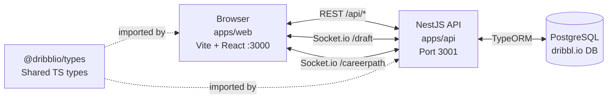
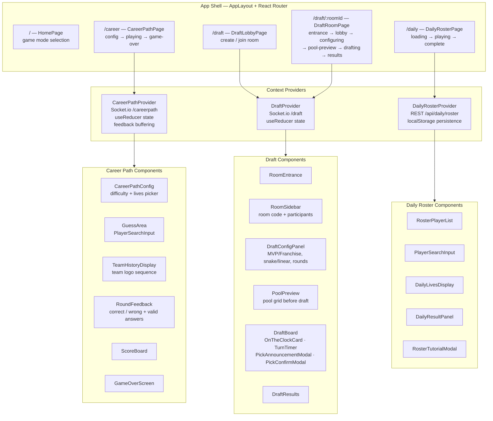
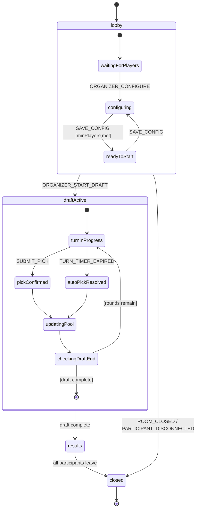
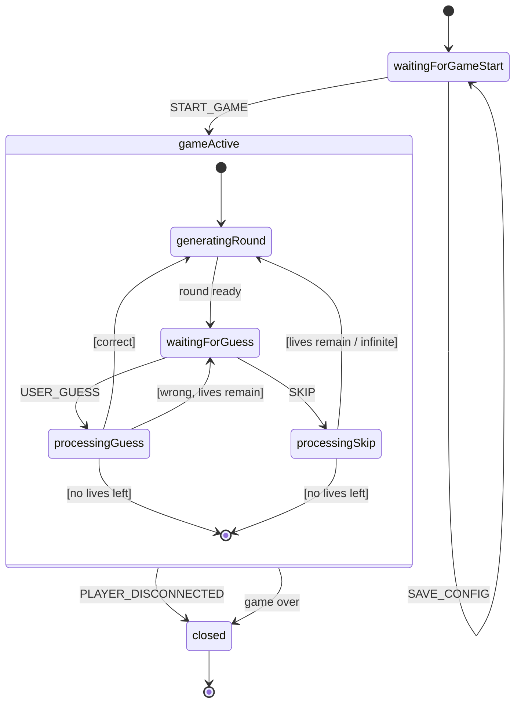
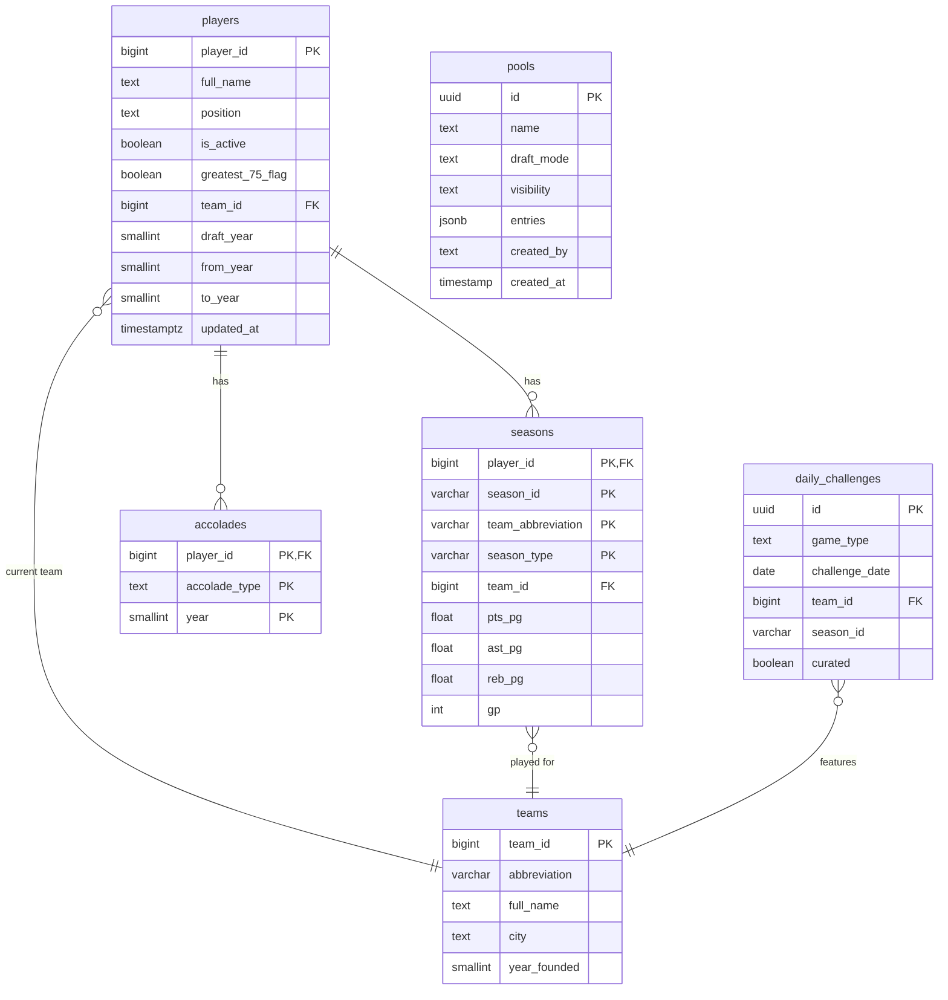

# dribbl.io Architecture

## 1. System Overview



---

## 2. Backend Module Structure

```mermaid
graph TD
    AppModule["AppModule\nThrottlerModule · ValidationPipe"]
    NbaModule["NbaModule"]
    HealthModule["HealthModule\nGET /api/health"]

    AppModule --> NbaModule
    AppModule --> HealthModule

    NbaModule --> DraftModule
    NbaModule --> CareerPathModule
    NbaModule --> DailyModule
    NbaModule --> PoolModule
    NbaModule --> PlayerModule
    NbaModule --> TeamModule

    subgraph DraftModule["DraftModule"]
        DG["DraftGateway\n/draft namespace\nwildcard SubscribeMessage"]
        DS["DraftService\nMap&lt;roomId, Actor&gt;\nmax 50 rooms"]
        DM["XState DraftMachine\nlobby → draft → results → closed"]
        DG --> DS
        DS --> DM
    end

    subgraph CareerPathModule["CareerPathModule"]
        CPG["CareerPathGateway\n/careerpath namespace\nwildcard SubscribeMessage"]
        CPS["CareerPathService\nMap&lt;roomId, Actor&gt;\nmax 200 rooms\nCTE career-signature queries"]
        CPM["XState CareerPathMachine\nwaitingForGameStart → gameActive → closed"]
        CPG --> CPS
        CPS --> CPM
    end

    subgraph DailyModule["DailyModule"]
        DSS["DailyScheduleService"]
        DSGS["DailyScheduleGeneratorService"]
        subgraph RosterModule["RosterModule"]
            RC["RosterController\nGET|POST /api/daily/roster/*"]
            RS["RosterService\nstateless guess validation"]
        end
    end

    subgraph PoolModule["PoolModule"]
        POC["PoolController\n/api/pools"]
        POS["PoolService\npool generation + persistence"]
        MVP["MvpPoolGenerator\nall MVP seasons"]
        FRAN["FranchisePoolGenerator\none player per franchise"]
        POS --> MVP
        POS --> FRAN
    end

    subgraph PlayerModule["PlayerModule"]
        PC["PlayerController\nGET /api/players"]
        PS["PlayerService\nrepository queries"]
    end

    subgraph TeamModule["TeamModule"]
        TC["TeamController\nGET /api/teams"]
        TS["TeamService"]
    end
```



---

## 3. Frontend Architecture



---

## 4. XState Machine — Draft



**Actors invoked in machine:**
- `socketActor` — root-level, full session lifetime; bidirectional Socket.io bridge
- `timerActor` (fromCallback) — invoked inside `turnInProgress`; auto-cancelled on transition
- `autoPickActor` — triggered on timer expiry; resolves pick automatically

---

## 5. XState Machine — Career Path



**Difficulty levels** (pool of playable players):
`firstAllNBA` → `allNBA` → `greatest75` → `allPlayers`

---

## 6. REST API Reference

| Method | Path | Description |
|--------|------|-------------|
| `GET` | `/api/health` | Health check |
| `GET` | `/api/players` | Search players (`?search=`) |
| `GET` | `/api/players/active` | Active players only |
| `GET` | `/api/players/:id` | Single player |
| `GET` | `/api/teams` | All teams |
| `GET` | `/api/teams/:id` | Single team |
| `GET` | `/api/pools/mvp` | MVP pool entries |
| `POST` | `/api/pools/preview` | Preview pool from config |
| `GET` | `/api/pools/public` | Paginated public pools |
| `GET` | `/api/pools/:id` | Single saved pool |
| `PATCH` | `/api/pools/:id` | Update saved pool |
| `DELETE` | `/api/pools/:id` | Delete saved pool |
| `GET` | `/api/daily/roster/today` | Today's daily challenge |
| `GET` | `/api/daily/roster/today/reveal` | Reveal full roster |
| `POST` | `/api/daily/roster/guess` | Submit a guess |
| `GET` | `/api/daily/roster/:date` | Challenge by date |
| `GET` | `/api/daily/roster/:date/reveal` | Reveal by date |
| `POST` | `/api/daily/roster/:date/guess` | Guess by date |
| `GET` | `/api/daily/roster/earliest-date` | Earliest available date |

---

## 7. Socket.io Event Reference

### `/draft` Namespace

| Direction | Event | Key Payload |
|-----------|-------|-------------|
| C → S | `PARTICIPANT_JOINED` | `{participant}` |
| C → S | `PARTICIPANT_LEFT` | `{participantId}` |
| C → S | `SAVE_CONFIG` | `{config, pool}` |
| C → S | `ORGANIZER_START_DRAFT` | `{pool?, turnOrder?}` |
| C → S | `ORGANIZER_CANCEL_DRAFT` | — |
| C → S | `SUBMIT_PICK` | `{pickRecord}` |
| C → S | `TURN_TIMER_EXPIRED` | — |
| C → S | `PARTICIPANT_DISCONNECTED` | `{participantId}` |
| C → S | `PARTICIPANT_RECONNECTED` | `{participantId}` |
| S → C | `ROOM_CREATED` | `{roomId}` |
| S → C | `NOTIFY_PARTICIPANT_JOINED` | `{participant, participants}` |
| S → C | `NOTIFY_CONFIG_SAVED` | `{config, pool}` |
| S → C | `NOTIFY_READY_TO_START` | — |
| S → C | `NOTIFY_DRAFT_STARTED` | `{pool, turnOrder}` |
| S → C | `NOTIFY_TURN_ADVANCED` | `{currentTurnIndex, participantId, currentRound}` |
| S → C | `NOTIFY_PICK_CONFIRMED` | `{pickRecord}` |
| S → C | `NOTIFY_POOL_UPDATED` | `{invalidatedIds}` |
| S → C | `NOTIFY_DRAFT_COMPLETE` | `{pickHistory}` |
| S → C | `ERROR` | `{message}` |

### `/careerpath` Namespace

| Direction | Event | Key Payload |
|-----------|-------|-------------|
| C → S | `SAVE_CONFIG` | `{config: {lives?, gameDifficulty}}` |
| C → S | `START_GAME` | — |
| C → S | `USER_GUESS` | `{guess: {guessId}}` |
| C → S | `SKIP` | — |
| C → S | `PLAYER_DISCONNECTED` | — |
| S → C | `NOTIFY_CONFIG_SAVED` | — |
| S → C | `NOTIFY_NEXT_ROUND` | `{score, team_history: string[], lives}` |
| S → C | `NOTIFY_CORRECT_GUESS` | `{validAnswers: Player[]}` |
| S → C | `NOTIFY_INCORRECT_GUESS` | `{lives, score}` |
| S → C | `NOTIFY_SKIP_ROUND` | `{lives}` |
| S → C | `NOTIFY_GAME_OVER` | — |
| S → C | `ERROR` | `{message}` |

---

## 8. Database Schema



---

## 9. Shared Types Package (`@dribblio/types`)

```
packages/types/src/
├── entities/
│   ├── player.entity.ts         # Player (TypeORM)
│   ├── team.entity.ts           # Team (TypeORM)
│   ├── season.entity.ts         # Season (TypeORM)
│   ├── accolade.entity.ts       # Accolade (TypeORM)
│   ├── daily-challenge.entity.ts
│   ├── pool.entity.ts           # SavedPool (TypeORM)
│   ├── draft-context.ts         # DraftMode, RoomConfig, PoolEntry, Participant, PickRecord, NbaDraftContext
│   ├── career-path-context.ts   # CareerPathConfig, CareerPathContext
│   └── game-difficulty.ts       # GameDifficulty enum
├── draft-events/
│   ├── inbound.ts               # NbaDraftEvent union (C → S)
│   └── outbound.ts              # DraftSocketActorEvent union (S → C)
├── career-path-events/
│   ├── inbound.ts               # CareerPathEvent union (C → S)
│   └── outbound.ts              # CareerPathSocketEvent union (S → C)
└── dtos/
    ├── start-draft.dto.ts
    ├── create-pool.dto.ts
    ├── update-pool.dto.ts
    └── daily-challenge.dto.ts   # DailyChallengeDto, RosterGuessDto, RosterRevealDto, RosterGuessResponseDto
```

> **Rule:** Never import TypeORM or NestJS-coupled types into `packages/` or `apps/cli`. Use lightweight interface mirrors instead.
